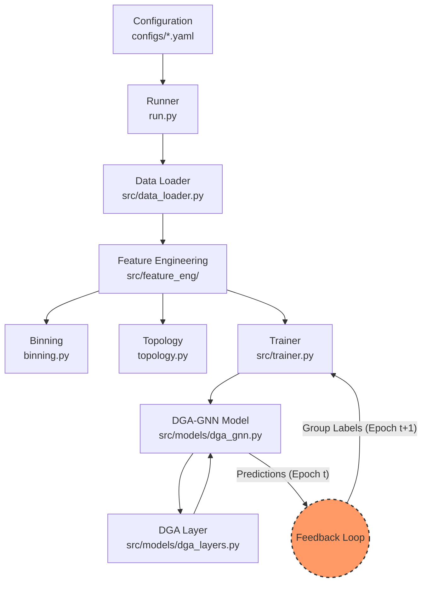

# Architecture: Fraud Detection GNN (DGA-GNN)

## Overview
This project implements a **Dynamic Grouping Aggregation GNN (DGA-GNN)** for fraud detection, designed to emulate the framework presented at AAAI 2024. It moves beyond standard GNNs by addressing non-additive attributes (like account age) and utilizing feedback loops to dynamically group neighbor nodes.

## Functional Diagram



## Folder Hierarchy

```text
C:.
├── .gitignore
├── .pre-commit-config.yaml
├── build_and_run.ps1
├── build_and_run_docker.ps1
├── docker-compose.yml
├── Dockerfile
├── GEMINI.md
├── manage.py
├── project_config.yaml
├── pyproject.toml
├── README.md
├── requirements-dev.txt
├── requirements.txt
├── run.py
├── tune.py
├── configs
│   └── elliptic.yaml
├── docs
│   └── FraudDetectionVault
├── src
│   ├── __init__.py
│   ├── data_loader.py
│   ├── trainer.py
│   ├── feature_eng
│   │   ├── __init__.py
│   │   ├── binning.py
│   │   └── topology.py
│   └── models
│       ├── __init__.py
│       ├── dga_gnn.py
│       └── dga_layers.py
└── tests
    ├── test_binning.py
    ├── test_data_loader.py
    ├── test_dga_gnn.py
    ├── test_dga_layers.py
    ├── test_elliptic_loader.py
    ├── test_topology.py
    ├── test_trainer.py
    └── data
```

## Core Components

### 1. Data Pipeline (`src/data_loader.py`)
-   **Ingestion**: Loads raw transaction data (CSV/Parquet).
-   **Graph Construction**: Builds DGL graphs from node and edge lists.
-   **Temporal Splitting**: Enforces strict time-based splits (Train: Jan-Jun, Val: Jul) to prevent data leakage and simulate real-world deployment.

### 2. Feature Engineering (`src/feature_eng/`)
-   **Binning (`binning.py`)**: Uses Decision Trees (via `toad` or `scikit-learn`) to optimally bin continuous features. Converts raw values into bin vectors (one-hot/ordinal) to preserve fraud probability distributions.
-   **Topology (`topology.py`)**: Extracts graph-based features using `networkx`, such as Degree Centrality, PageRank, and Community Detection (Louvain).

### 3. Model Architecture (`src/models/`)
-   **DGA-GNN (`dga_gnn.py`)**: The main GNN model orchestrating the layers.
-   **DGA Layer (`dga_layers.py`)**: A custom message-passing layer that aggregates neighbor information differently based on their predicted group (e.g., "Potential Fraud" vs. "Potential Benign").

### 4. Training & Feedback Loop (`src/trainer.py`)
-   **Feedback Dynamic Grouping**: A critical innovation where the model's predictions from epoch $t$ are used to update node group labels for epoch $t+1$. This allows the GNN to learn distinct aggregation strategies for suspicious vs. legitimate neighbors.
-   **Optimization**: Standard PyTorch training loop with CrossEntropyLoss and Adam optimizer.

## Tech Stack
-   **Language**: Python 3.11
-   **Graph Learning**: Deep Graph Library (DGL) v1.1+
-   **Deep Learning**: PyTorch & PyTorch Lightning
-   **Feature Engineering**: Toad, Scikit-learn, Pandas, NetworkX
-   **Configuration**: Hydra / YAML
-   **Orchestration**: Docker & Docker Compose

## Future Enhancements
-   **Heterogeneous Graphs**: Incorporate Device and IP entities.
-   **Contrastive Learning**: DCL-GFD for detecting camouflaged fraud.
-   **Explainability (XAI)**: SHAP/Integrated Gradients for model transparency.

## Implementation Strategy

### Phase 1: Foundation (Data & Features)
**Goal:** Verify "Input" reliability before "Logic" complexity.
-   **Data Loading**: Implement strictly temporal splitting (Train < Val < Test) to match fraud detection reality.
-   **Topology**: Verify centrality calculations on known graph structures (e.g., star graph).
-   **Binning**: ensure continuous features (Age, Amount) are discretely encoded to preserve probability distributions.

### Phase 2: Core Model (DGA Logic)
**Goal:** Verify the custom "Dynamic Grouping" mechanism.
-   **DGA Layer**: Implement `message_func` and `reduce_func`.
-   **Validation**: Test with a synthetic graph (1 Fraud Neighbor, 1 Benign Neighbor) to confirm the layer aggregates them differently based on their group label.

### Phase 3: Assembly & Feedback (System)
**Goal:** Connect components and verify the feedback loop.
-   **Trainer**: Implement the loop where `Epoch T` predictions become `Epoch T+1` group labels.
-   **Validation**: Monitor group label evolution across epochs to ensure dynamic adaption.
